# Widget Reference

Complete reference for every widget in the `gui` package. All widgets are methods on `*Context` and follow the immediate-mode pattern: call them every frame to draw, check return values for interaction.

## Table of Contents

- [Text Widgets](#text-widgets)
- [Button Widgets](#button-widgets)
- [Input Widgets](#input-widgets)
- [Selection Widgets](#selection-widgets)
- [Layout Widgets](#layout-widgets)
- [Scrollable Widgets](#scrollable-widgets)
- [Table Widget](#table-widget)
- [Data Visualization Widgets](#data-visualization-widgets)
- [Tree/Collapsing Widgets](#treecollapsing-widgets)
- [Section Widget](#section-widget)
- [Hint Widgets](#hint-widgets)
- [Modal Menu](#modal-menu)
- [Toast Notifications](#toast-notifications)
- [Utility Widgets](#utility-widgets)
- [Panel Registry](#panel-registry)
- [Drag Support](#drag-support)

---

## Text Widgets

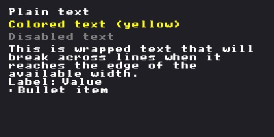

### Text

Draws plain text at the current cursor position.

```go
ctx.Text("Hello World")
```

### TextColored

Draws text with a specific color.

```go
ctx.TextColored("Warning!", gui.ColorYellow)
```

### TextDisabled

Draws text with the disabled/grayed-out style color.

```go
ctx.TextDisabled("Not available")
```

### TextWrapped

Draws text with automatic word wrapping. Pass `maxWidth=0` to use the current layout width.

```go
ctx.TextWrapped("This long text will wrap automatically at word boundaries.", 0)
ctx.TextWrapped("Fixed width wrap.", 300)
```

### LabelText

Draws a label and value side by side in an HStack.

```go
ctx.LabelText("Name:", "John")
```

### BulletText

Draws a bullet point followed by text.

```go
ctx.BulletText("First item")
ctx.BulletText("Second item")
```

---

## Button Widgets

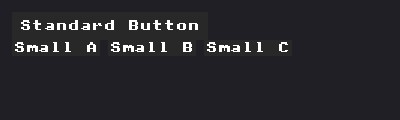

### Button

Draws a clickable button. Returns `true` when clicked.

```go
if ctx.Button("Save") {
    save()
}
```

**Options:** `WithID`, `WithDisabled`, `WithWidth`, `WithHeight`

```go
if ctx.Button("Delete", gui.WithDisabled(readOnly), gui.WithWidth(100)) {
    delete()
}
```

### SmallButton

Draws a smaller button with reduced padding. Same API as `Button`.

```go
if ctx.SmallButton("x") {
    close()
}
```

---

## Input Widgets

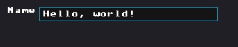
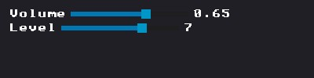
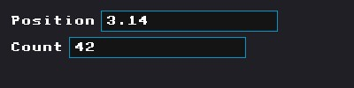
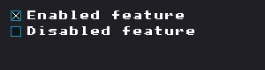
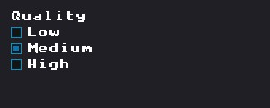
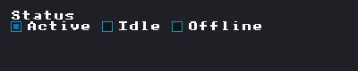
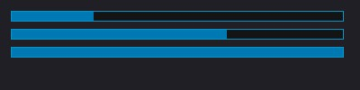
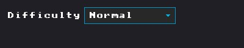

### InputText

Full-featured text input with cursor positioning, text selection, clipboard (Ctrl+C/V/X), undo/redo (Ctrl+Z/Y), and keyboard navigation. Returns `true` if the value changed.

```go
var name string
if ctx.InputText("Name", &name) {
    onNameChanged(name)
}
```

**Options:** `WithID`, `WithDisabled`, `WithWidth`, `ForceFocus`

**Keyboard shortcuts:**
| Key | Action |
|-----|--------|
| Left/Right | Move cursor |
| Ctrl+Left/Right | Move by word |
| Home/End | Jump to start/end |
| Shift+movement | Extend selection |
| Ctrl+A | Select all |
| Ctrl+C/X/V | Copy/Cut/Paste |
| Ctrl+Z | Undo |
| Ctrl+Y / Ctrl+Shift+Z | Redo |
| Enter | Confirm and unfocus |
| Escape | Cancel and unfocus |
| Backspace/Delete | Delete character or selection |

**State type:** `InputTextState` (cursor position, selection, undo stack, scroll offset)

### SliderFloat

Horizontal slider for `float32` values. Returns `true` when the value changes.

```go
var volume float32 = 0.5
if ctx.SliderFloat("Volume", &volume, 0, 1) {
    setVolume(volume)
}
```

**Options:** `WithID`, `WithWidth`, `WithFormat`, `WithStep`

```go
ctx.SliderFloat("Angle", &angle, 0, 360, gui.WithFormat("%.0f"), gui.WithStep(5))
```

**Interaction:** Click+drag to adjust. Mouse wheel when hovered. Left/Right arrows when focused.

**State type:** `SliderState` (drag tracking)

### SliderInt

Integer variant of `SliderFloat`. Automatically sets step=1 and format=`%d`.

```go
var count int = 5
ctx.SliderInt("Count", &count, 0, 100)
```

### NumberInputFloat

Numeric input with drag-to-adjust and text edit mode. Click to enter text mode, drag left/right to adjust value. Returns `true` when the value changes.

```go
ctx.HStack()(func() {
    ctx.NumberInputFloat("", &x, gui.WithPrefix("X:"), gui.WithWidth(60))
    ctx.NumberInputFloat("", &y, gui.WithPrefix("Y:"), gui.WithWidth(60))
    ctx.NumberInputFloat("", &z, gui.WithPrefix("Z:"), gui.WithWidth(60))
})
```

**Options:** `WithID`, `WithWidth`, `WithFormat`, `WithStep`, `WithRange`, `WithDragSpeed`, `WithPrefix`, `WithSuffix`

**Interaction:**
| Action | Result |
|--------|--------|
| Click+drag | Adjust value by dragging |
| Click (release, < 3px) | Enter text edit mode |
| Enter (in text mode) | Confirm value |
| Escape (in text mode) | Cancel edit |
| Left/Right (focused) | Adjust by step |

**State type:** `NumberInputState`

### NumberInputInt

Integer variant of `NumberInputFloat`. Automatically sets step=1 and format=`%d`.

```go
var count int = 10
ctx.NumberInputInt("Items", &count, gui.WithRange(0, 100))
```

### Checkbox

Checkbox with label. Returns `true` when toggled. Mutates the `*bool` directly.

```go
var enabled bool
if ctx.Checkbox("Enable feature", &enabled) {
    applyFeature(enabled)
}
```

**Options:** `WithID`, `WithDisabled`

### RadioButton

Single radio button. Returns `true` when clicked. Does not manage group state; use multiple calls or `RadioGroup`.

```go
if ctx.RadioButton("Option A", selectedIndex == 0) {
    selectedIndex = 0
}
if ctx.RadioButton("Option B", selectedIndex == 1) {
    selectedIndex = 1
}
```

**Options:** `WithID`, `WithDisabled`

### RadioGroup

Draws a vertical group of radio buttons. Returns `true` if the selection changed.

```go
items := []string{"Low", "Medium", "High"}
if ctx.RadioGroup("Quality", &selectedIndex, items) {
    applyQuality(selectedIndex)
}
```

**Options:** `WithID`, `WithColumns`

Multi-column layout:
```go
ctx.RadioGroup("Mode", &mode, modes, gui.WithColumns(3))
```

### RadioGroupHorizontal

Same as `RadioGroup` but items are arranged in a horizontal row.

```go
items := []string{"On", "Off"}
ctx.RadioGroupHorizontal("Status", &status, items)
```

### ProgressBar

Draws a progress bar. `fraction` should be 0.0 to 1.0. Does not return a value.

```go
ctx.ProgressBar(0.75)
ctx.ProgressBar(progress, gui.WithWidth(200), gui.WithHeight(20))
```

**Options:** `WithWidth`, `WithHeight`

### ComboBox

Dropdown selection widget. Returns `true` when the selection changes.

```go
items := []string{"Low", "Medium", "High"}
if ctx.ComboBox("Quality", &selectedIndex, items) {
    applyQuality(selectedIndex)
}
```

**Options:** `WithID`, `WithWidth`, `WithSearchable`, `WithMaxDropdownHeight`

```go
ctx.ComboBox("Model", &idx, modelNames, gui.WithSearchable(), gui.WithMaxDropdownHeight(300))
```

The dropdown renders on the `ForegroundDrawList` (always on top). Supports keyboard navigation (Up/Down/Enter/Escape) when open and type-to-filter with `WithSearchable()`.

**State type:** `ComboBoxState` (open, scroll, hovered index, keyboard index, search text)

---

## Selection Widgets

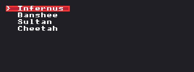

### Selectable

Selectable list item with highlight. Returns `true` when clicked. Shows a left-edge cyan indicator bar and `>` prefix when selected.

```go
for i, item := range items {
    if ctx.Selectable(item.Name, i == selected, gui.WithID(fmt.Sprintf("item_%d", i))) {
        selected = i
    }
}
```

**Options:** `WithID`, `WithDisabled`

### SelectableRow

Wraps content with selection highlighting. Use for custom selectable rows containing multiple widgets.

```go
ctx.SelectableRow(isSelected, 180)(func() {
    ctx.Text("Label:")
    ctx.InputText("", &value, gui.WithID("input"))
})
```

---

## Layout Widgets

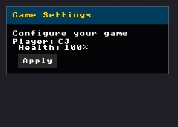
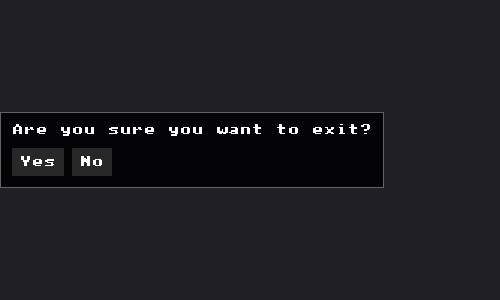
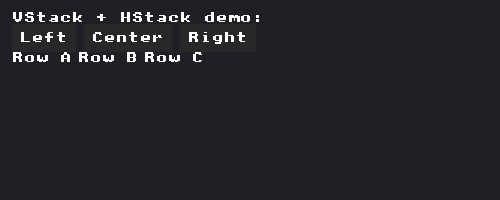

### Panel

Container with background, border, and optional title header. Returns a closure to call with content.

```go
ctx.Panel("My Panel", gui.Width(300), gui.Padding(12))(func() {
    ctx.Text("Content goes here")
    ctx.Button("Click me")
})
```

**Layout options:** `Gap`, `GapX`, `GapY`, `Padding`, `PaddingXY`, `Width`, `Height`, `Align`, `Justify`, `WithHotkey`, `MaxHeight`

With hotkey display (renders `"Menu [T]"` in the header):
```go
ctx.Panel("Menu", gui.WithHotkey("T"))(func() { ... })
```

### CenteredPanel

Panel centered on screen using two-pass layout (measures on frame N, centers on frame N+1). Solves the "can't center without knowing size" problem.

```go
ctx.CenteredPanel("dialog")(func() {
    ctx.Text("Are you sure?")
    if ctx.Button("Yes") { ... }
})
```

### VStack

Vertical layout container (items stack top to bottom). Default gap is `style.ItemSpacing`.

```go
ctx.VStack(gui.Gap(8))(func() {
    ctx.Text("Line 1")
    ctx.Text("Line 2")
})
```

**Layout options:** `Gap`, `GapX`, `GapY`, `Padding`, `Width`, `Height`, `Align`, `Justify`

### HStack

Horizontal layout container (items stack left to right).

```go
ctx.HStack(gui.Gap(8))(func() {
    ctx.Text("Label:")
    ctx.InputText("", &value)
})
```

### Row

Alias for `HStack` with default options.

```go
ctx.Row(func() {
    ctx.Text("A")
    ctx.Text("B")
})
```

---

## Scrollable Widgets

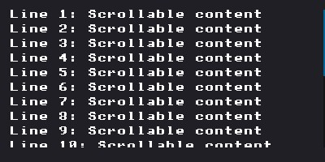
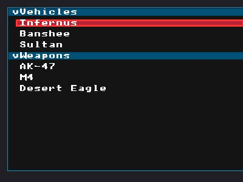

### Scrollable

Generic scrollable wrapper for any content. Supports vertical and optional horizontal scrolling, scrollbar dragging, keyboard scrolling (PageUp/Down/Home/End), and automatic scroll-to-focus for keyboard navigation.

```go
ctx.Scrollable("my_scroll", 300, gui.ShowScrollbar(true))(func() {
    ctx.Text("Line 1")
    ctx.Button("Click me")
    ctx.SliderFloat("Volume", &vol, 0, 1)
    // ... unlimited content
})
```

**Options:** `ShowScrollbar`, `ScrollbarPosition`, `EnableHorizontal`, `ClampToContent`, `FocusY`

```go
ctx.Scrollable("scroll", 400,
    gui.ShowScrollbar(true),
    gui.ScrollbarPosition(gui.ScrollbarLeft),
    gui.EnableHorizontal(),
)(func() { ... })
```

**Auto-scroll:** Automatically scrolls to keep focused children visible when navigating with keyboard. A 300ms cooldown after manual scrolling prevents fighting between user and auto-scroll.

**Programmatic scroll:**
```go
gui.EnsureScrollVisible(ctx, "my_scroll", targetY, viewportHeight, padding)
```

**State type:** `ScrollableState` (scroll X/Y, content size, drag state, focus tracking)

### ListBox

Scrollable list area with smooth scroll interpolation. Simpler than `Scrollable`, designed specifically for lists.

```go
ctx.ListBox("items", 200, gui.Gap(4))(func() {
    for i, item := range items {
        ctx.Selectable(item.Name, i == selected, gui.WithID(item.ID))
    }
})
```

**Layout options:** `Gap`, `Padding`, etc.

**State type:** `ScrollState` (scroll Y, target Y for smooth interpolation, content height)

### List

Advanced list with collapsible sections, search filter, and nested widget support. Returns a `*ListBuilder` for fluent configuration.

```go
list := ctx.List("objects", 400, gui.ShowScrollbar(true), gui.WithFilter("Search..."))

list.Section("Vehicles", gui.DefaultOpen()).
    Item("Infernus", selected == 0).
    Item("Banshee", selected == 1).
    ItemFunc("Custom", selected == 2, func() {
        ctx.SliderFloat("Speed", &speed, 0, 100)
    }).
    End()

list.Section("Settings").
    ItemFunc("Scale", false, func() {
        ctx.HStack()(func() {
            ctx.NumberInputFloat("", &x, gui.WithPrefix("X:"))
        })
    }).
    End()

clickedIdx := list.End()
```

**Options:** `ShowScrollbar`, `WithFilter`, `WithMultiSelect`, `DefaultOpen`, `WithWidth`

**API:**
- `list.Section(name, opts...)` - Start a collapsible section
- `section.Item(label, selected)` - Simple selectable item (filtered by search)
- `section.ItemFunc(label, selected, func())` - Item with custom widget content
- `section.End()` - Finish the section
- `list.End() int` - Finish the list, returns clicked item index (-1 if none)
- `list.OnSelect(func(int))` - Set selection callback

**State type:** `ListState` (scroll, collapsed sections, search text, selection)

---

## Table Widget

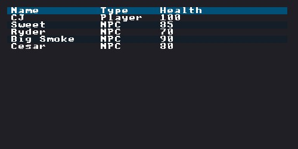

### BeginTable / EndTable

Draws a data table with columns, headers, sorting indicators, row selection, and borders.

```go
columns := []gui.TableColumn{
    {Label: "Name", InitWidth: 200},
    {Label: "Size", Flags: gui.TableColumnFlagsWidthFixed, InitWidth: 80},
    {Label: "Type", Flags: gui.TableColumnFlagsWidthStretch},
}

table := ctx.BeginTable("files", columns,
    gui.TableFlagsBorders|gui.TableFlagsRowBg|gui.TableFlagsSortable|gui.TableFlagsHighlightHover,
    0, 300)

if table != nil {
    table.TableHeadersRow()
    for _, file := range files {
        table.TableNextRow()
        table.TableText(file.Name)
        table.TableText(file.Size)
        table.TableTextColored(file.Type, gui.ColorGray)
    }
    table.EndTable()
}
```

**TableFlags:**

| Flag | Description |
|------|-------------|
| `TableFlagsResizable` | Enable column resizing |
| `TableFlagsSortable` | Show sort indicators |
| `TableFlagsRowSelect` | Enable row selection with focus |
| `TableFlagsScrollY` | Enable vertical scrolling |
| `TableFlagsStickyHeader` | Keep header visible when scrolling |
| `TableFlagsAutoSizeColumns` | Auto-size columns to content |
| `TableFlagsBordersInnerH/V` | Inner borders |
| `TableFlagsBordersOuterH/V` | Outer borders |
| `TableFlagsBorders` | All borders |
| `TableFlagsRowBg` | Alternate row backgrounds |
| `TableFlagsHighlightHover` | Highlight hovered row |

**TableColumnFlags:**

| Flag | Description |
|------|-------------|
| `TableColumnFlagsWidthFixed` | Fixed width (uses `InitWidth`) |
| `TableColumnFlagsWidthStretch` | Stretch to fill remaining space |
| `TableColumnFlagsWidthAuto` | Auto-size to content (default) |
| `TableColumnFlagsNoResize` | Disable manual resizing |
| `TableColumnFlagsNoSort` | Disable sorting for this column |

**Table methods:**
- `table.TableHeadersRow()` - Draw column headers with sort indicators
- `table.TableNextRow()` - Start a new data row
- `table.TableNextColumn() Vec2` - Move to next column, returns draw position
- `table.TableText(text)` - Draw text in current column (auto-truncates)
- `table.TableTextColored(text, color)` - Draw colored text
- `table.TableIsRowHovered() bool` - Check if current row is hovered
- `table.TableIsRowClicked() bool` - Check if current row was clicked
- `table.EndTable()` - Finish the table

**State type:** `TableState` (column widths, sort column/direction, selected row, scroll offset)

### BeginTableVirtualized

Virtualized table for large datasets (1000+ rows). Only renders visible rows. Requires `height` and `totalRows`.

```go
table := ctx.BeginTableVirtualized("data", cols, flags, 0, 400, 10000)
if table != nil {
    table.TableHeadersRow()
    for i := table.FirstVisibleRow(); i < table.LastVisibleRow(); i++ {
        if table.TableNextRowVirtualized(i) {
            table.TableTextVirtualized(data[i].Name)
            table.TableTextVirtualized(data[i].Value)
        }
    }
    table.EndTable()
    table.HandleScrollInput()
}
```

Additional methods for virtualized tables:
- `table.FirstVisibleRow() int` - First row index to render
- `table.LastVisibleRow() int` - One past last row index to render
- `table.TableNextRowVirtualized(rowIdx int) bool` - Start row at specific index
- `table.TableTextVirtualized(text)` - Draw text with scroll offset
- `table.TableTextColoredVirtualized(text, color)` - Colored variant
- `table.ScrollToRow(rowIdx int)` - Programmatic scroll
- `table.HandleScrollInput()` - Process mouse wheel for scrolling

---

## Data Visualization Widgets

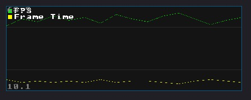
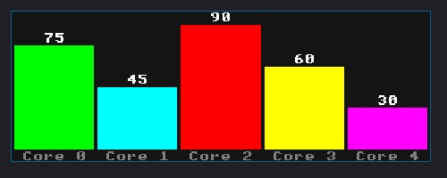


### Graph

Line graph for time-series data. Supports multiple data series, hover tooltips, grid lines, and legend.

```go
data := []gui.GraphData{
    {Label: "FPS", Values: fpsHistory, Color: gui.ColorGreen},
    {Label: "Frame Time", Values: frameTimeHistory, Color: gui.ColorYellow},
}
ctx.Graph("perf_graph", data, 100,
    gui.WithGraphGridLines(4),
    gui.WithGraphLegend(),
)
```

**Options:** `WithWidth`, `WithGraphYRange(min, max)`, `WithGraphGridLines(n)`, `WithGraphLegend`

**Interaction:** Hover to see vertical crosshair and tooltip with values at that data point.

**State type:** `GraphState` (hovered index, zoom, pan offset)

### Histogram

Bar chart for comparing values. Supports vertical (default) and horizontal orientations, hover tooltips, and value labels.

```go
bars := []gui.HistogramBar{
    {Label: "Core 0", Value: 75, Color: gui.ColorGreen},
    {Label: "Core 1", Value: 45, Color: gui.ColorYellow},
    {Label: "Core 2", Value: 90, Color: gui.ColorRed},
}
ctx.Histogram("cpu_usage", bars, 100, gui.WithHistogramShowValues())
```

**Options:** `WithWidth`, `WithHistogramYRange(min, max)`, `WithHistogramShowValues`, `WithHistogramHorizontal`

**Interaction:** Hover over bars to see tooltip with label and value. Bars brighten on hover.

**State type:** `HistogramState` (hovered bar index)

### Sequencer

Animation timeline with tracks and keyframes. Includes play/pause controls, time ruler, track labels, keyframe markers, and a playhead.

```go
config := gui.SequencerConfig{
    Duration:    10.0,
    CurrentTime: currentTime,
    Tracks: []gui.SequencerTrack{
        {Name: "Root", Keyframes: []float32{0, 2.5, 5.0, 7.5}, Color: gui.ColorCyan},
        {Name: "Arm_L", Keyframes: []float32{0, 3.0, 6.0}, Color: gui.ColorGreen},
    },
    Playing: isPlaying,
    OnSeek:  func(t float32) { currentTime = t },
    OnPlay:  func() { isPlaying = true },
    OnPause: func() { isPlaying = false },
}

if ctx.Sequencer("anim_seq", config, 200, gui.WithSequencerControls()) {
    // Time was changed by user scrubbing
}
```

**Options:** `WithWidth`, `WithSequencerControls`

**Interaction:**
- Click/drag on timeline to scrub playhead
- Mouse wheel to zoom
- Click track labels to select, click collapse indicator to toggle
- Space to toggle play/pause (when hovered)

**State type:** `SequencerState` (zoom, pan, collapsed tracks, selected track/keyframe, scrubbing)

---

## Tree/Collapsing Widgets

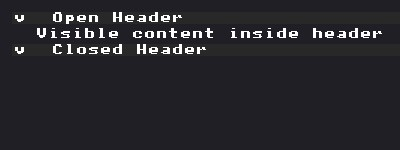
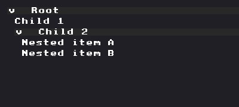

### CollapsingHeader

Collapsible header that shows/hides content. Returns `true` when expanded. Starts open by default.

```go
if ctx.CollapsingHeader("Advanced Settings") {
    ctx.SliderFloat("Detail", &detail, 0, 1)
    ctx.Checkbox("Shadows", &shadows)
}
```

**Options:** `WithID`, `Focused`

**State type:** `CollapsingHeaderState` (open)

### TreeNode / TreePop

Tree node with auto-indentation. Returns `true` when expanded. Must call `TreePop()` when content is done.

```go
if ctx.TreeNode("Root") {
    ctx.Text("Child 1")
    if ctx.TreeNode("Nested") {
        ctx.Text("Deep child")
        ctx.TreePop()
    }
    ctx.TreePop()
}
```

**Options:** same as `CollapsingHeader`

---

## Section Widget

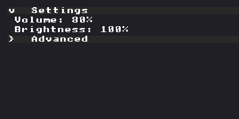

### Section

Collapsible section with arrow indicator, auto-indentation, keyboard focus, and auto-scroll support. Supports nesting.

```go
ctx.Section("Settings")(func() {
    ctx.SliderFloat("Volume", &vol, 0, 1)
    ctx.Section("Advanced")(func() {
        ctx.Text("Nested content")
    })
})
```

**Options:** `WithID`, `DefaultOpen`, `Focused`, `Open(&boolVar)`, `IndentSize(px)`, `NoIndent`

Controlled mode (external state):
```go
ctx.Section("Windows", gui.Open(&windowsExpanded))(func() { ... })
```

**Manual API:** For cases where closures don't fit:
```go
if ctx.BeginSection("Settings", gui.DefaultOpen()) {
    ctx.Text("Content")
    ctx.EndSection()
}
```

**Programmatic control:**
```go
sectionID := ctx.GetID("my_section")
gui.ToggleSectionState(ctx, sectionID)
gui.SetSectionOpen(ctx, sectionID, true)
open := gui.IsSectionOpen(ctx, sectionID)
```

**State type:** `SectionState` (open, indent)

---

## Hint Widgets

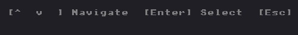

Consistent styled text helpers for keyboard hints, status messages, and empty states.

### HintFooter

Draws a separator followed by keyboard hint text. Renders as `[Key] Action  [Key] Action`.

```go
ctx.HintFooter(
    gui.Hint(gui.HintKeyUpDown, "Navigate"),
    gui.Hint(gui.HintKeyEnter, "Select"),
    gui.Hint(gui.HintKeyEscape, "Close"),
)
```

**Presets:**
```go
ctx.HintFooterNav()     // [Up/Down] Navigate  [Enter] Select  [Esc] Close
ctx.HintFooterConfirm() // [Enter] Confirm  [Esc] Cancel
ctx.HintFooterClose()   // [Esc] Close
ctx.HintFooterToggle()  // [Enter] Toggle  [Esc] Close
ctx.HintFooterSearch()  // [Type] Search  [Bksp] Clear  [Esc] Close
```

### HintHeader

Draws hint text at the top of a section.

```go
ctx.HintHeader("Type to search...")
```

### HintEmpty

Draws an empty-state message (defaults to "(none)").

```go
if len(items) == 0 {
    ctx.HintEmpty("No items found")
}
```

### HintStatus

Draws a formatted status line.

```go
ctx.HintStatus("%d/%d visible", enabledCount, totalCount)
```

### HintScroll

Creates scroll position indicators for manual list rendering. Call `Before()` and `After()` around the list items.

```go
scroll := ctx.HintScroll(scrollOffset, visibleItems, totalItems).WithCount()
scroll.Before(ctx) // "^ 5 more above" (if applicable)
for i := startIdx; i < endIdx; i++ {
    // draw items
}
scroll.After(ctx)  // "v 10 more below" (if applicable)
```

### HintComingSoon

Draws "(coming soon)" placeholder text.

```go
ctx.HintComingSoon()
```

---

## Modal Menu

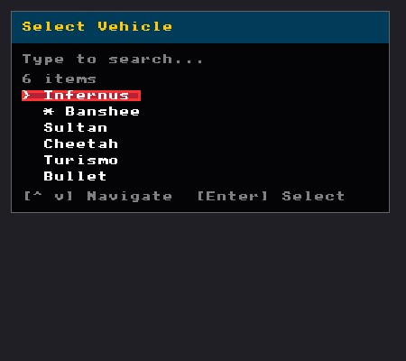

A standalone searchable modal menu widget for data selection. Implements the `Panel` interface.

### Setup

```go
menu := gui.NewModalMenu("Select Item", 300, 15)
menu.SetDataSource(myDataSource)  // implements gui.MenuDataSource
menu.SetDelegate(myDelegate)      // implements gui.MenuDelegate
menu.SetPosition(100, 50)
menu.SetHotkey("F2")
```

### Interfaces

**MenuDataSource** - provides items to display:
```go
type MenuDataSource interface {
    Count() int
    Label(index int) string
    IsMarked(index int) bool
    Filter(query string)
}
```

**MenuDelegate** - receives interaction callbacks:
```go
type MenuDelegate interface {
    OnSelect(index int)   // Selection changed (preview)
    OnConfirm(index int)  // User confirmed (Enter/click)
    OnCancel()            // User cancelled (Escape)
}
```

### Usage in Frame Loop

```go
// Input handling
if menu.IsOpen() {
    menu.HandleInput(input)
}

// Drawing
menu.Draw(ctx)

// Toggle
if keyPressed {
    menu.Toggle()
}
```

**Features:** Type-to-search filtering, keyboard navigation (Up/Down/PageUp/PageDown/Home/End), mouse wheel scrolling, click to confirm, draggable panel, scroll indicators.

---

## Toast Notifications

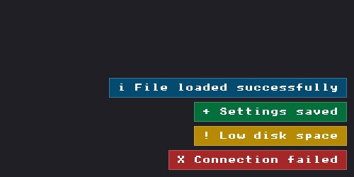

Timed popup messages that appear in the bottom-right corner with fade in/out animation.

### Setup

```go
var toasts gui.ToastState
```

### Adding Toasts

```go
toasts.ToastInfo("File loaded")
toasts.ToastSuccess("Saved successfully")
toasts.ToastWarning("Low disk space")
toasts.ToastError("Connection failed")

// Custom duration
toasts.Toast("Custom message", gui.ToastTypeInfo, 5.0)
```

### Rendering

Call `Update` and `DrawToasts` every frame:
```go
toasts.Update(deltaTime)
ctx.DrawToasts(&toasts)
```

**Toast types:** `ToastTypeInfo`, `ToastTypeSuccess`, `ToastTypeWarning`, `ToastTypeError`

**Constants:** `DefaultToastDuration = 3.0s`, `ToastMaxVisible = 5`

---

## Utility Widgets

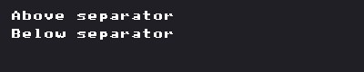

### Separator

Draws a horizontal line across the current layout width.

```go
ctx.Separator()
```

### Spacing

Adds vertical space in pixels.

```go
ctx.Spacing(8)
```

### Bullet

Draws a small square bullet point (inline element, advances cursor horizontally).

```go
ctx.Bullet()
ctx.Text("Point") // appears after bullet on same line
```

### Indent / Unindent

Shifts cursor X position for manual indentation.

```go
ctx.Indent(16)
ctx.Text("Indented content")
ctx.Unindent(16)
```

### SameLine

Places the next widget on the same line as the previous one.

```go
ctx.Text("Label:")
ctx.SameLine()
ctx.Text("Value")
```

### Tooltip

Shows a tooltip at the mouse position. Call immediately after the widget you want to annotate.

```go
ctx.Button("Save")
ctx.Tooltip("Save the current file")
```

---

## Panel Registry

Manages a collection of panels with automatic hotkey handling, mutual exclusion, input routing, cursor capture, and Ctrl+Tab focus cycling.

### Setup

```go
registry := gui.NewPanelRegistry()
registry.SetExclusive(true) // Opening one panel closes others
registry.SetCursorChangeCallback(func(captured bool) { ... })
```

### Registering Panels

Panels must implement the `gui.Panel` interface (`Open`, `Close`, `Toggle`, `IsOpen`, `CanOpen`, `Draw`, `HandleInput`).

```go
registry.Register("Menu", menuPanel, gui.KeyF1, 10)
registry.RegisterWithCursor("Settings", settingsPanel, gui.KeyF2, 5, true)
registry.RegisterWithBinding("Search", searchPanel, checkSearchKey, 8, true, false, "Menu")
```

### Frame Loop

```go
// Handle hotkeys
registry.HandleHotkeys(input, isModelViewMode)

// Route input to open panels
registry.HandleInput(input)

// Draw all panels
registry.Draw(ctx)
```

---

## Drag Support

### DraggablePanel

Embeddable struct that adds drag-to-move and edge snapping to panels.

```go
drag := gui.NewDraggablePanel(100, 50) // initial x, y
drag.Draggable = true
drag.SnapConfig = gui.DefaultSnapConfig()
```

In draw method:
```go
drag.HandleDrag(ctx)
ctx.SetCursorPos(drag.Position.X, drag.Position.Y)
// ... draw panel ...
drag.Size = gui.Vec2{X: panelW, Y: panelH}
drag.DrawSnapGuides(ctx)
```

---

## Spacing Constants

Use these instead of magic numbers:

```go
gui.SpaceNone  // 0
gui.SpaceXS    // 2
gui.SpaceSM    // 4  (default item spacing)
gui.SpaceMD    // 8  (default padding)
gui.SpaceLG    // 12
gui.SpaceXL    // 16
gui.Space2XL   // 24
gui.Space3XL   // 32
gui.Space4XL   // 48
```

---

## Color Helpers

Colors are packed as `0xAABBGGRR` (OpenGL byte order).

```go
gui.RGBA(255, 0, 0, 255)     // Red
gui.RGBAf(1.0, 0.0, 0.0, 1.0) // Red (float)
r, g, b, a := gui.UnpackRGBA(color)
```

**Predefined:** `ColorWhite`, `ColorBlack`, `ColorRed`, `ColorGreen`, `ColorBlue`, `ColorYellow`, `ColorCyan`, `ColorMagenta`, `ColorGray`, `ColorDarkGray`, `ColorLightGray`, `ColorTransparent`
